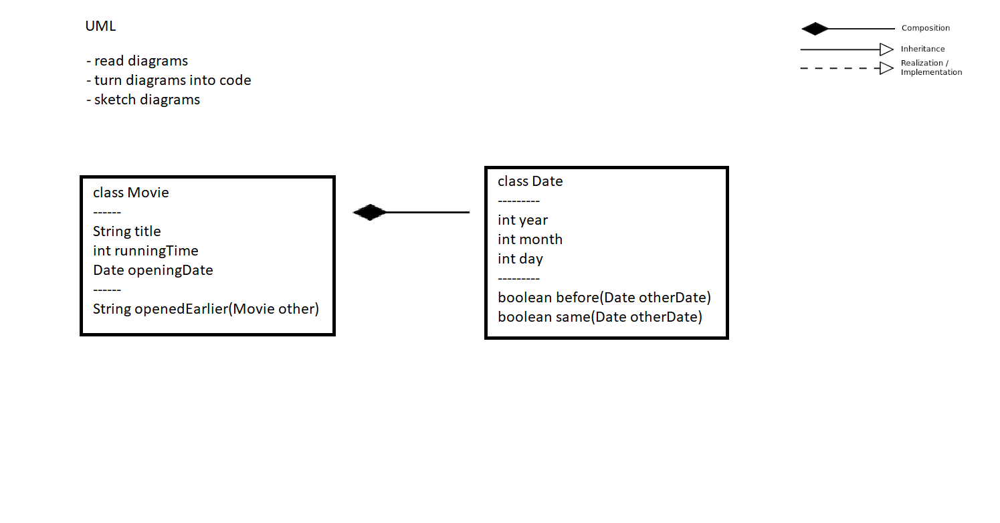
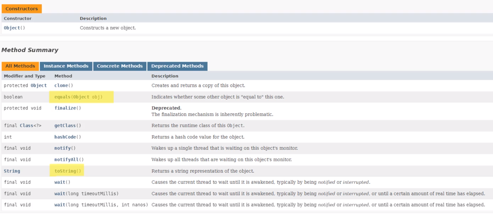
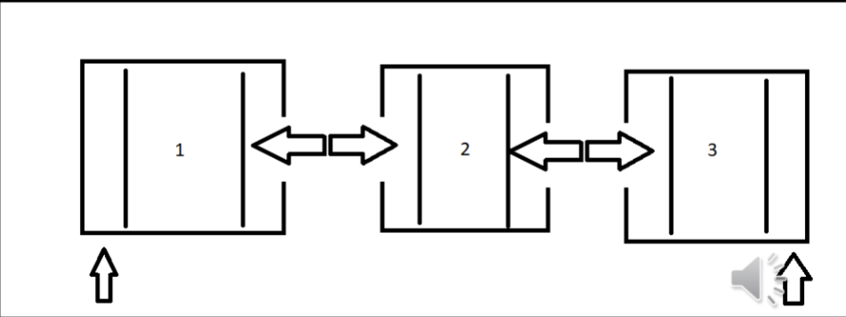
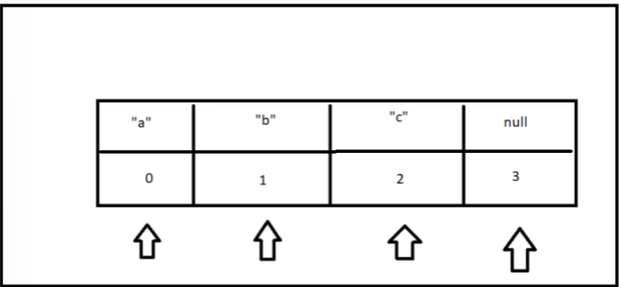
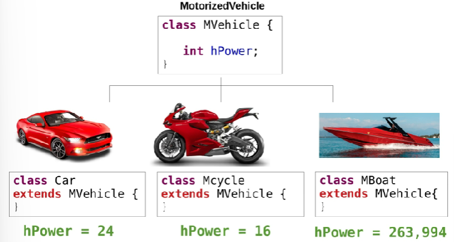
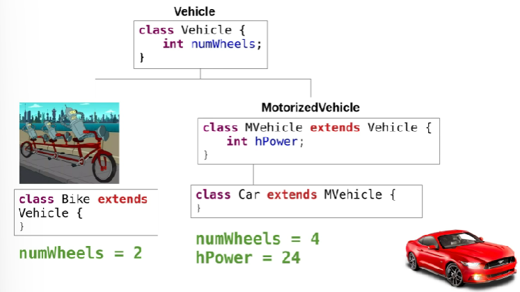
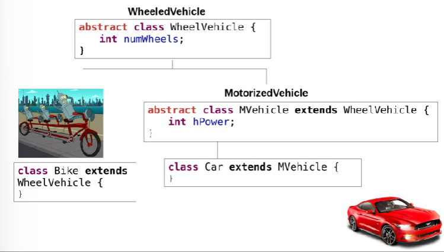
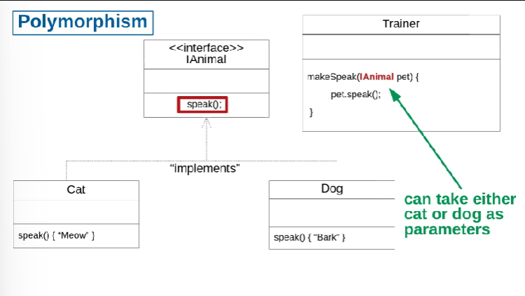
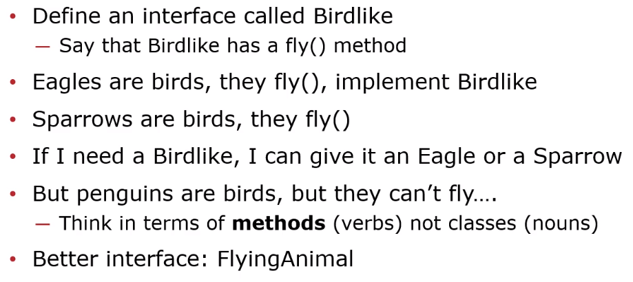

# CS2102 Notes

## Lecture 1
- Basic setup of a class and method in java
</ul>

    public class Main{
        public static void main(String[] args){
            return
        }
    }
1) **Def:** The *void* declaration states the output type. In this case void means nothing is returned. 
2) **Def:** The *static* declaration means that only one of this method exists. In this case there is only one main method in the class or subclasses. 
   
Printing Methods:

    System.out.println("Hello World")
    System.out.printf("Hello %s \n", "CS2102")

1) *printf* is a formatting printing system where the % case is subsituted. %s is a substitution for strings
2) *println* prints to system out on a new line

Testing Code for HW

    public class Example{
        @Test
        public void test2x2(){
            assertEquals(4, 2 * 2)
            # assertEquals(expected value, output value, errorAllowance)
        }
    }

- Uses a library called junit4 and is useful for debugging
  
Now we can upscale! Time for object orientated programming:
- A simple example:
</ul>

    import org.junit.Test;

    import static org.junit.Assert.assertEquals;

    public class Examples {
        @Test
        public void testDoublingNumbers(){
            assertEquals(4, 2*2);
        }

        @Test
        public void testTriple(){
            Multiplier multi = new Multiplier();
            assertEquals(3, multi.triple(1), 0.01);
        }

        @Test
        public void testCandies(){
            Multiplier multi = new Multiplier();
            assertEquals(10, multi.costForCandy(20), 0.01);
        }
    }

Notice how objects are created from the Multiplier class using  ``Multiplier multi = new Multiplier();``. This is a call of the class below:

    public class Multiplier {

        /**
        * A function that triples its input
        * @param number any number
        * @return 3x that number
        */
        public double triple(double number){
            return 3 * number;
        }

        /**
        * calculates the total cost of a bunch of candy
        * @param candies the amount of candies
        * @return the total cost at $.50 per candy
        */
        public double costForCandy(int candies){
            double costEach = 0.50;
            return candies * costEach;
        }
    }

- **Def:** *Java Docs* is a professional way of stating and documenting how your code works. It is done as such and stated _before_ the method declaration:
</ul>

    /**
    * calculates the total cost of a bunch of candy
    * @param candies the amount of candies
    * @return the total cost at $.50 per candy
    */

## Lecture 2
- *Trinary conditional* or *Elvis Operator* is ?:
  - ``Boolean Expression ? True-Expression : False-Expression``
  - When the boolean expression is true, evaluate the true expressions, otherwise evaluate the false expression
  
## Lecture 3
- Object Orientated Programming and UML diagrams:

  
    - Notice that Date is a subclass (a composite) of class Movie
    - A composition uses parts of another (composite) class as field variables
- Classes and constructors:
  - The Date method is the constructor for the class
</ul>

    public class Date{
        public int date;
        public int year;
        public int month;
        public int day;
        /* THIS BLOCK are called FIELDS

        public Date(){
            this.year = 0;
            this.month = 0;
            this.date =  0;
            /* the constructor INTIALIZES the fields
        }

        public Date(int year, int month, innt day){
            this.year = year;
            this.month = month;
            this.day = day;
        }
        public boolean before(Date otherDate){
            return this.year < otherDate.year 
            || (this.year == otherDate.year && this.month < otherDate.month)
            || (this.year == otherDate.year && this.month == otherDate.month && this.day < otherDate.day);
        }
    }

-The *this* keyword allows access to the object and the direct field variables
    -Without using the this keyword, the paramater variable in the method is accessed instead

Invoking constructors using the *new* keyword:

    Date newDate = new Date(1999, July, 17);

## Lecture 4
Abstraction into classes
Implementation for the UML below:

    class Movie{
        private String title;
        private int runningTime;
        private Date openingDate;

        public Movie(String title, int runningTime, Date openingDate){
            this.title = title;
            this.runningTime = runningTime;
            this.openingDate = opening Date;
        }

        public String getTitle(){
            return this.title;
        }

        public int getRunningTime(){
            return this.runningTime;
        }

        public Date getOpeningDate(){
            return this.openingDate;
        }

        String openedEarlier(Movie other){
            if (this.openingDate.before(other.getOpeningDate())){
                return this.title;
            }
            else if (other.getOpeningDate.before(this.openingDate)){
                return other.getTitle();
            }
            else {
                return "Same Opening Date";
            }
        }

    }

    class Date {
        private int year;
        private int month;
        private int day;

        public Date(year, month, day){
            this.year = year;
            this.month = month;
            this.day = day;
        }

        public int getYear(){
            return this.year;
        }

        public int getMonth(){
            return this.month;
        }

        public int getDay(){
            return this.day;
        }

        public boolean before(Date otherDate){
            return this.year < otherDate.getYear() 
            || (this.year == otherDate.getYear() && this.month < otherDate.getMonth())
            || (this.year == otherDate.getYear() && this.month == otherDate.getMonth() && this.day < otherDate.getDay());
        }
    }

## Lecture 5
**SOLID**:

- S: Single Responsibility Principle
  - All methods/calculations should only use the fields in its own class for calculations
  - If you need to calculate using a field's field then that calculation should be returned from that field as a method
- Ex: Say you want to find the amount of time a battery of a robot can last for a specfic amount of current draw from a motor on the robot. 
</ul>
BAD EXAMPLE

    class Robot{
        private Motor motor;
        private Battery battery;
        
        public Robot(...){
            ...
            //Constructor
        }
        public double calculatePowerTime(){
            /*BAD:*/ 
            return this.battery.getPower() / this.motor.getCurrentDraw();
            
        }

    }

GOOD EXAMPLE:
    class Battery{
        private double power;

        public Battery(...){
            ...
            //Constructor
        }
        public double timeLeftFromCurrentDraw(double currDraw){
            return this.power / currDraw;
        }
    }

    class Robot{
        private Motor motor;
        private Battery battery;
        
        public Robot(...){
            ...
            //Constructor
        }
        public double calculatePowerTime(){
            /*GOOD*/
            currDraw = this.motor.getCurrentDraw()
            return this.battery.timeLeftFromCurrentDraw(currDraw);
        }

    }

## Lecture 6

**SOLID**
  
- O: Open Close & Method Overloading
  - Use client-code where higher class code does not need to change 
  - We can call or become a subclass of that class without directly changing anything in the class
  - *Open to Extension*
    - Inheritance
      - Code reuse
      - Method Overriding
      - Abstract Classes
    - Composition
      - Interfaces
- All Objects in Java are part of the OBJECT type
    
- A common example of overriding method is overriding the object common class of toString() 
- Putting ``@Override`` before a method you are overriding will give you a compile time error if the method does not succefully override a method
  - Can be used to make sure your override code is working as expected
  
## Lecture 7
- Lists!!!
- Different types of lists:
  - ``java.util.List``
    - Immutable List (size can't be changed)
    - ``List<String> names = List.of("Drawgan", "Aria", "Bob");``
  - ``java.util.LinkedList``
    - Mutable List (size can change)
    - ``List<String> stores = new LinkedList<>();``
    - ``stores.add("Walmart");``
  - ``java.util.ArrayList``
    - Mutable List
    - ``List<String> corporations = new ArrayList<>();``
    - ``corporations.add("Disney");``
  - Use the ``size()`` method to find the number of items in a list
- How does a **LinkedList** work?
  - https://docs.oracle.com/en/java/javase/17/docs/api/java.base/java/util/LinkedList.html
  - Each node of a linked list has "3" nodes that connect it to the node before and after it
  - VERY good for adding and removing things from the beginning or end but very inefficient for retrieving items randomly in the middle
  - 
- How does an **Array List** work?
  - https://docs.oracle.com/en/java/javase/17/docs/api/java.base/java/util/ArrayList.html
  - Each node is assinged a respective index node to it
  - Good for retriveing random items but bad for adding or removing items from the beginning or end
    - Every time the arraylist needs to add an item it creates an array of size n+1, then moves all the values over and deletes the old array
    - VERY inefficent!
  - 
  
**For-each loops**

- loops through all the numbers in a list~ kind of like python
- Syntax:
  - ``for ('type' i : 'listname'){}``
  
</ul>

    public double sum(List<Double> numbers){
        double total = 0.0;
        for(Double number : numbers){
            total += number;
        }
        return total;
    }
## Lecture 8

- extending class (creating subclass
- Uses the ``extend`` keyword)
  - ``class Car extends motorVehicle{}``
  

- **subclasses** can also **inherit** fields from **superclasses** they extend from
  - at the same time **subclasses** can have private fields that are independent of general **superclasses** they extend from
  - in the case below number of wheels is a field that all vehicle classes use but horsepower is only used in motorized vehicle classes

**Def: Abstract** classes
  - classes that exist where it doesn't make sense for them to be proper instances (instamtiated)
  - use the keyword ``abstract`` before the ``class`` definition keyword
    - ``abstract class MotorizedVehicle extends Vehicle{}``
  - tend to be superclasses
  - subclasses still inherit superclasses/abstract classes fields and properties
  - Ex:
  
    - It doesn't make sense for a proper instance of a "motorized vehicle to exist" or a general "vehicle" 
  
Method calling in OOP
- All subclasses can call *every* method in superclasses
- So what happens if two subclasses need to call a method of one name but the resulting implementation is different for each subclass? 
- **Polymorphism**
  - A superclass will define a method and the subclasses will implement that method according to the needs of that subclass
    - The superclass method is called the **interface**
  - This way a method can use the subclass object's method and depending on the subclass that the actual object is part of the code will run without fail
  - Ex:
  

##### Interfaces and implementation
- First create an interface class that serves as a superclass of classes that implement that interface
- EX: Imagine animals that can fit into a cage and a subclass called boa that represents a boa snake that can uses the animals interface
- Notice that the class definition is no longer used below
  - ``public interface Cageable{{}``
- The ``implement`` keyword is used for implementation classes, like the use of the ``extend``keyword
</ul>
    public interface Cageable {

    /**
     * Computes whether this animal can fit in a cage
     * @param exhibitSideLength with a square side length
     * @return true if the animal fits
     */
    public boolean fitInExhibit(int exhibitSideLength);

    /**
     * @return the name of the animal
     */
    public String name();
    }

    public class Boa implements Cageable{
    public String name;
    public int length;
    public String favFood;
    public boolean isHuggable;

    public Boa(String name, int length, String favFood, boolean isHuggable){
        this.name = name;
        this.length = length;
        this.favFood = favFood;
        this.isHuggable = isHuggable;
    }

    public boolean fitInExhibit(int exhibitSideLength){
        return this.length < 4 * exhibitSideLength;
    }

    /**
     * @return the name of the animal
     */
    @Override
    public String name() {
        return this.name;
    }
    }

    public class Zoo {
    public List<Cageable> animals;
    public Zoo(List<Cageable> animals){
        this.animals = animals;
    }

    /**
     * Produces the list of animals that fit in the Exhibit
     * @param exhibitSideLength assuming a square exhibit enclosure
     * @return the list of animals that fit in the exhibit.
     */
    public List<String> allThatFit(int exhibitSideLength){
        List<String> fit = new LinkedList<>();
        for(Cageable animal : this.animals){
            if(animal.fitInExhibit(exhibitSideLength)){
                fit.add(animal.name());
            }
        }
        return fit;
    }
}

##### SOLID- Liskov Substitution Principle
- Every time you *need* a super type, you can *use* a subtype
- Define interfaces by *verbs* (methods) not *nouns* (classes)
  - Ex: 

## Lecture 9
##### Inheritance

- Syntax:
  - **extends**: makes 1 class inherit from another
    - EX: ``class wolf extends canine``
  - ``super(**list super class fields here**)``: Calls the constructor of the super class
    - Use inside the subclass constructor
    - MUST be the first command in the sub class constructor
  - ``super.**super field/method name**``: access fields and methods of a parent object
    - similar to ``this`` keyword but for inheritance
- Good inheritance coding:
  - **D.R.Y**: Don't Repeat Yourself
    - if you have classes that have the same fields and helper methods using those fields, consider a common super class
  - **W.E.T**: Write Everything Twice
    - Only consider a common superclass when you *encounter* redundancy
    - Don't abstract too early