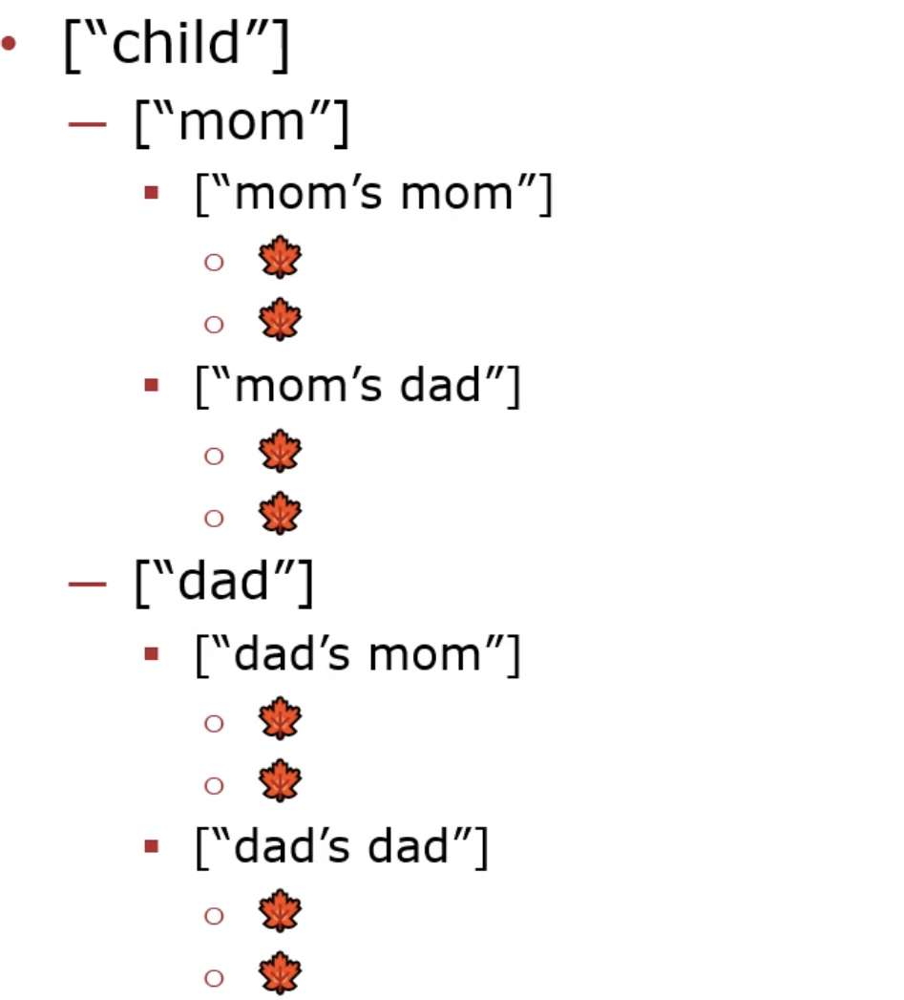
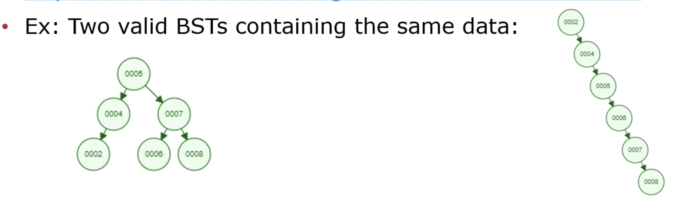
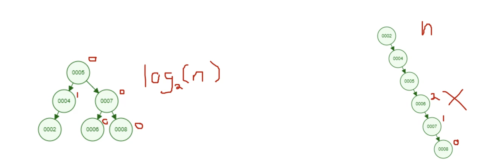
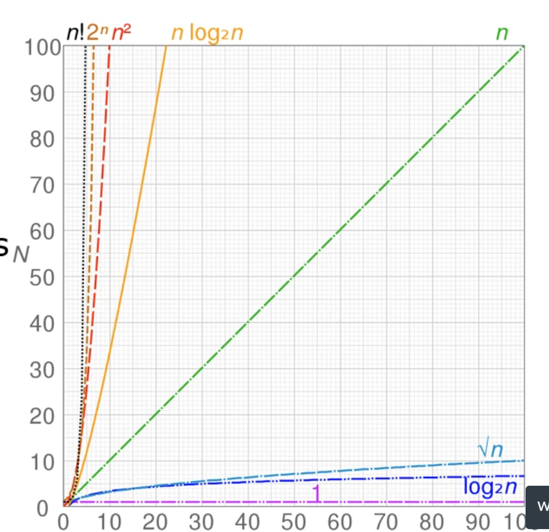
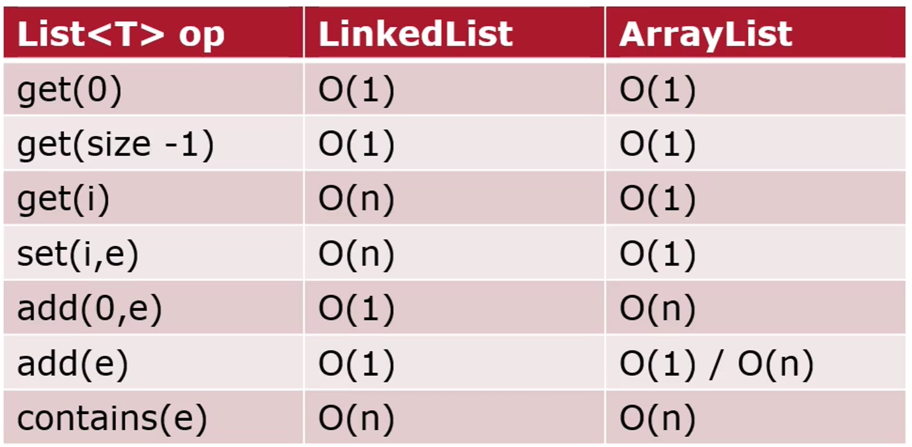
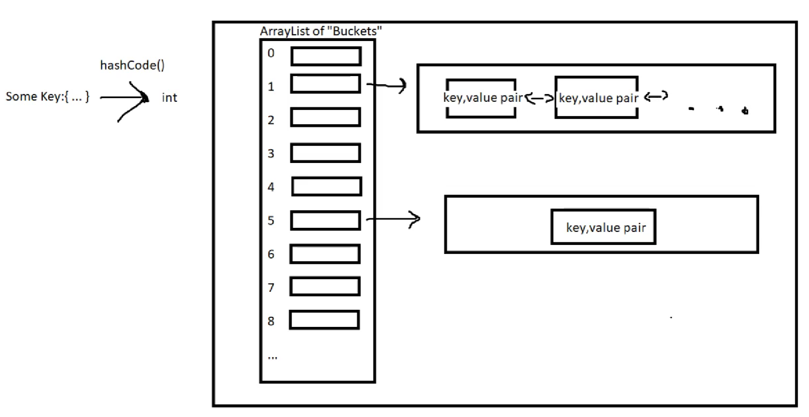
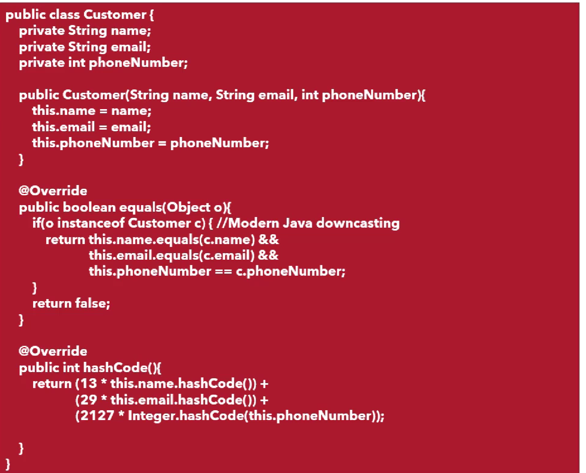
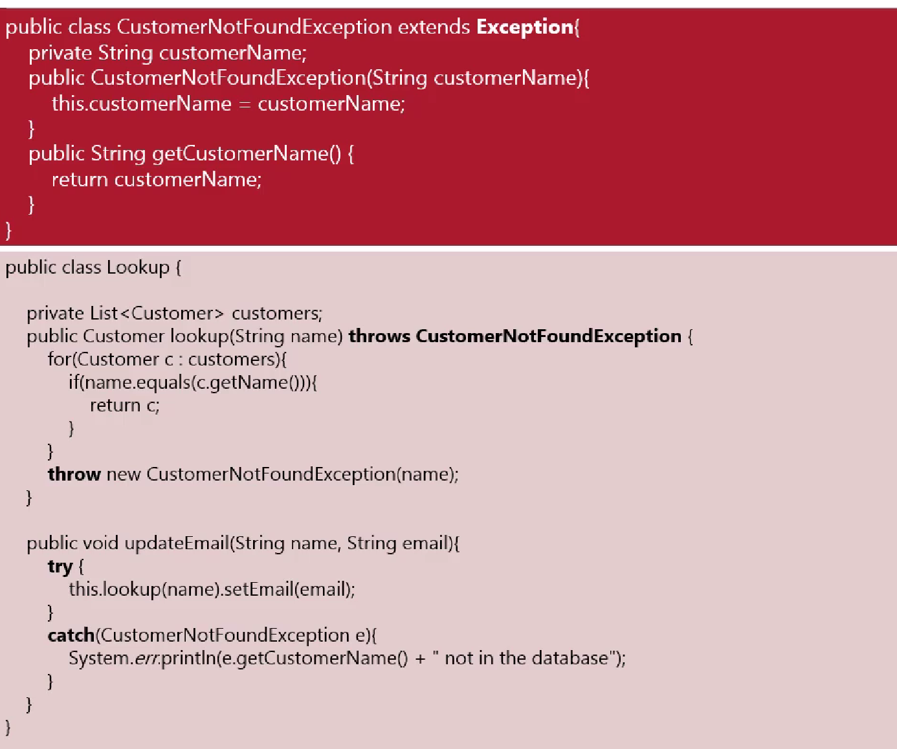

# CS2102 Notes

## Lecture 1
- Basic setup of a class and method in java
</ul>

    public class Main{
        public static void main(String[] args){
            return
        }
    }
1) **Def:** The *void* declaration states the output type. In this case void means nothing is returned. 
2) **Def:** The *static* declaration means that only one of this method exists. In this case there is only one main method in the class or subclasses. 
   
Printing Methods:

    System.out.println("Hello World")
    System.out.printf("Hello %s \n", "CS2102")

1) *printf* is a formatting printing system where the % case is subsituted. %s is a substitution for strings
2) *println* prints to system out on a new line

Testing Code for HW

    public class Example{
        @Test
        public void test2x2(){
            assertEquals(4, 2 * 2)
            # assertEquals(expected value, output value, errorAllowance)
        }
    }

- Uses a library called junit4 and is useful for debugging
  
Now we can upscale! Time for object orientated programming:
- A simple example:
</ul>

    import org.junit.Test;

    import static org.junit.Assert.assertEquals;

    public class Examples {
        @Test
        public void testDoublingNumbers(){
            assertEquals(4, 2*2);
        }

        @Test
        public void testTriple(){
            Multiplier multi = new Multiplier();
            assertEquals(3, multi.triple(1), 0.01);
        }

        @Test
        public void testCandies(){
            Multiplier multi = new Multiplier();
            assertEquals(10, multi.costForCandy(20), 0.01);
        }
    }

Notice how objects are created from the Multiplier class using  ``Multiplier multi = new Multiplier();``. This is a call of the class below:

    public class Multiplier {

        /**
        * A function that triples its input
        * @param number any number
        * @return 3x that number
        */
        public double triple(double number){
            return 3 * number;
        }

        /**
        * calculates the total cost of a bunch of candy
        * @param candies the amount of candies
        * @return the total cost at $.50 per candy
        */
        public double costForCandy(int candies){
            double costEach = 0.50;
            return candies * costEach;
        }
    }

- **Def:** *Java Docs* is a professional way of stating and documenting how your code works. It is done as such and stated _before_ the method declaration:
</ul>

    /**
    * calculates the total cost of a bunch of candy
    * @param candies the amount of candies
    * @return the total cost at $.50 per candy
    */

## Lecture 2
- *Trinary conditional* or *Elvis Operator* is ?:
  - ``Boolean Expression ? True-Expression : False-Expression``
  - When the boolean expression is true, evaluate the true expressions, otherwise evaluate the false expression
  
## Lecture 3
- Object Orientated Programming and UML diagrams:

  
    - Notice that Date is a subclass (a composite) of class Movie
    - A composition uses parts of another (composite) class as field variables
- Classes and constructors:
  - The Date method is the constructor for the class
</ul>

    public class Date{
        public int date;
        public int year;
        public int month;
        public int day;
        /* THIS BLOCK are called FIELDS

        public Date(){
            this.year = 0;
            this.month = 0;
            this.date =  0;
            /* the constructor INTIALIZES the fields
        }

        public Date(int year, int month, innt day){
            this.year = year;
            this.month = month;
            this.day = day;
        }
        public boolean before(Date otherDate){
            return this.year < otherDate.year 
            || (this.year == otherDate.year && this.month < otherDate.month)
            || (this.year == otherDate.year && this.month == otherDate.month && this.day < otherDate.day);
        }
    }

-The *this* keyword allows access to the object and the direct field variables
    -Without using the this keyword, the paramater variable in the method is accessed instead

Invoking constructors using the *new* keyword:

    Date newDate = new Date(1999, July, 17);

## Lecture 4
Abstraction into classes
Implementation for the UML below:


    class Movie{
        private String title;
        private int runningTime;
        private Date openingDate;

        public Movie(String title, int runningTime, Date openingDate){
            this.title = title;
            this.runningTime = runningTime;
            this.openingDate = opening Date;
        }

        public String getTitle(){
            return this.title;
        }

        public int getRunningTime(){
            return this.runningTime;
        }

        public Date getOpeningDate(){
            return this.openingDate;
        }

        String openedEarlier(Movie other){
            if (this.openingDate.before(other.getOpeningDate())){
                return this.title;
            }
            else if (other.getOpeningDate.before(this.openingDate)){
                return other.getTitle();
            }
            else {
                return "Same Opening Date";
            }
        }

    }

    class Date {
        private int year;
        private int month;
        private int day;

        public Date(year, month, day){
            this.year = year;
            this.month = month;
            this.day = day;
        }

        public int getYear(){
            return this.year;
        }

        public int getMonth(){
            return this.month;
        }

        public int getDay(){
            return this.day;
        }

        public boolean before(Date otherDate){
            return this.year < otherDate.getYear() 
            || (this.year == otherDate.getYear() && this.month < otherDate.getMonth())
            || (this.year == otherDate.getYear() && this.month == otherDate.getMonth() && this.day < otherDate.getDay());
        }
    }

## Lecture 5
**SOLID**:

- S: Single Responsibility Principle
  - All methods/calculations should only use the fields in its own class for calculations
  - If you need to calculate using a field's field then that calculation should be returned from that field as a method
- Ex: Say you want to find the amount of time a battery of a robot can last for a specfic amount of current draw from a motor on the robot. 
</ul>
BAD EXAMPLE

    class Robot{
        private Motor motor;
        private Battery battery;
        
        public Robot(...){
            ...
            //Constructor
        }
        public double calculatePowerTime(){
            /*BAD:*/ 
            return this.battery.getPower() / this.motor.getCurrentDraw();
            
        }

    }

GOOD EXAMPLE:
    class Battery{
        private double power;

        public Battery(...){
            ...
            //Constructor
        }
        public double timeLeftFromCurrentDraw(double currDraw){
            return this.power / currDraw;
        }
    }

    class Robot{
        private Motor motor;
        private Battery battery;
        
        public Robot(...){
            ...
            //Constructor
        }
        public double calculatePowerTime(){
            /*GOOD*/
            currDraw = this.motor.getCurrentDraw()
            return this.battery.timeLeftFromCurrentDraw(currDraw);
        }

    }

## Lecture 6

**SOLID**
  
- O: Open Close & Method Overloading
  - Use client-code where higher class code does not need to change 
  - We can call or become a subclass of that class without directly changing anything in the class
  - *Open to Extension*
    - Inheritance
      - Code reuse
      - Method Overriding
      - Abstract Classes
    - Composition
      - Interfaces
- All Objects in Java are part of the OBJECT type
    
- A common example of overriding method is overriding the object common class of toString() 
- Putting ``@Override`` before a method you are overriding will give you a compile time error if the method does not succefully override a method
  - Can be used to make sure your override code is working as expected
  
## Lecture 7
- Lists!!!
- Different types of lists:
  - ``java.util.List``
    - Immutable List (size can't be changed)
    - ``List<String> names = List.of("Drawgan", "Aria", "Bob");``
  - ``java.util.LinkedList``
    - Mutable List (size can change)
    - ``List<String> stores = new LinkedList<>();``
    - ``stores.add("Walmart");``
  - ``java.util.ArrayList``
    - Mutable List
    - ``List<String> corporations = new ArrayList<>();``
    - ``corporations.add("Disney");``
  - Use the ``size()`` method to find the number of items in a list
- How does a **LinkedList** work?
  - https://docs.oracle.com/en/java/javase/17/docs/api/java.base/java/util/LinkedList.html
  - Each node of a linked list has "3" nodes that connect it to the node before and after it
  - VERY good for adding and removing things from the beginning or end but very inefficient for retrieving items randomly in the middle
  - 
- How does an **Array List** work?
  - https://docs.oracle.com/en/java/javase/17/docs/api/java.base/java/util/ArrayList.html
  - Each node is assinged a respective index node to it
  - Good for retriveing random items but bad for adding or removing items from the beginning or end
    - Every time the arraylist needs to add an item it creates an array of size n+1, then moves all the values over and deletes the old array
    - VERY inefficent!
  - 
  
**For-each loops**

- loops through all the numbers in a list~ kind of like python
- Syntax:
  - ``for ('type' i : 'listname'){}``
  
</ul>

    public double sum(List<Double> numbers){
        double total = 0.0;
        for(Double number : numbers){
            total += number;
        }
        return total;
    }
## Lecture 8

- extending class (creating subclass
- Uses the ``extend`` keyword)
  - ``class Car extends motorVehicle{}``
  


- **subclasses** can also **inherit** fields from **superclasses** they extend from
  - at the same time **subclasses** can have private fields that are independent of general **superclasses** they extend from
  - in the case below number of wheels is a field that all vehicle classes use but horsepower is only used in motorized vehicle classes


**Def: Abstract** classes
  - classes that exist where it doesn't make sense for them to be proper instances (instamtiated)
  - use the keyword ``abstract`` before the ``class`` definition keyword
    - ``abstract class MotorizedVehicle extends Vehicle{}``
  - tend to be superclasses
  - subclasses still inherit superclasses/abstract classes fields and properties
  - Ex:
  
    - It doesn't make sense for a proper instance of a "motorized vehicle to exist" or a general "vehicle" 
  
Method calling in OOP
- All subclasses can call *every* method in superclasses
- So what happens if two subclasses need to call a method of one name but the resulting implementation is different for each subclass? 
- **Polymorphism**
  - A superclass will define a method and the subclasses will implement that method according to the needs of that subclass
    - The superclass method is called the **interface**
  - This way a method can use the subclass object's method and depending on the subclass that the actual object is part of the code will run without fail
  - Ex:
  

##### Interfaces and implementation
- First create an interface class that serves as a superclass of classes that implement that interface
- EX: Imagine animals that can fit into a cage and a subclass called boa that represents a boa snake that can uses the animals interface
- Notice that the class definition is no longer used below
  - ``public interface Cageable{{}``
- The ``implement`` keyword is used for implementation classes, like the use of the ``extend``keyword
</ul>
    public interface Cageable {

    /**
     * Computes whether this animal can fit in a cage
     * @param exhibitSideLength with a square side length
     * @return true if the animal fits
     */
    public boolean fitInExhibit(int exhibitSideLength);

    /**
     * @return the name of the animal
     */
    public String name();
    }


    public class Boa implements Cageable{
    public String name;
    public int length;
    public String favFood;
    public boolean isHuggable;

    public Boa(String name, int length, String favFood, boolean isHuggable){
        this.name = name;
        this.length = length;
        this.favFood = favFood;
        this.isHuggable = isHuggable;
    }

    public boolean fitInExhibit(int exhibitSideLength){
        return this.length < 4 * exhibitSideLength;
    }

    /**
     * @return the name of the animal
     */
    @Override
    public String name() {
        return this.name;
    }
    }


    public class Zoo {
    public List<Cageable> animals;
    public Zoo(List<Cageable> animals){
        this.animals = animals;
    }

    /**
     * Produces the list of animals that fit in the Exhibit
     * @param exhibitSideLength assuming a square exhibit enclosure
     * @return the list of animals that fit in the exhibit.
     */
    public List<String> allThatFit(int exhibitSideLength){
        List<String> fit = new LinkedList<>();
        for(Cageable animal : this.animals){
            if(animal.fitInExhibit(exhibitSideLength)){
                fit.add(animal.name());
            }
        }
        return fit;
    }
}

##### SOLID- Liskov Substitution Principle
- Every time you *need* a super type, you can *use* a subtype
- Define interfaces by *verbs* (methods) not *nouns* (classes)
  - Ex: 

## Lecture 9
##### Inheritance

- Syntax:
  - **extends**: makes 1 class inherit from another
    - EX: ``class wolf extends canine``
  - ``super(**list super class fields here**)``: Calls the constructor of the super class
    - Use inside the subclass constructor
    - MUST be the first command in the sub class constructor
  - ``super.**super field/method name**``: access fields and methods of a parent object
    - similar to ``this`` keyword but for inheritance
- Good inheritance coding:
  - **D.R.Y**: Don't Repeat Yourself
    - if you have classes that have the same fields and helper methods using those fields, consider a common super class
  - **W.E.T**: Write Everything Twice
    - Only consider a common superclass when you *encounter* redundancy
    - Don't abstract too early
## Lecture 12
##### Real Time Processing
- "Eager" computation
- Data is processed as it is recieved
  - Cleaning/parsing is done on data input
- Pros: 
  - Data becomes available for reuse immediately
  - Query output is fast
- Cons:
  - If data is never needed, can waste computation
  - If lots of data is inputted, data input can be slow

##### Batch Processing
- "lazy" computation
- Data is processed as it is queried
  - Cleaning/parsing is done just before query output
- Pros:
  - if cleaning/parsing is expensive, can be done only as needed
  - Data input is fast since it is simple storage
- Cons:
  - Can store uncleaned data for a long time before processing
  - Query output can be slow

## Lecture 13
##### Template Method Pattern
- Simplified Def:
  - Treat an object like an assembly line (in -> out)
  - Make a super class (parent class) to hold all the steps
  - Make each step into a method
    - If a step has a default implementation give it one
    - If a step depends on a subclass then make it abstract
  - When you have a variation:
    - Extend the super class
    - Implement/override the steps for the variation
    - Inherit the methods that do not change
- What is it good for?
  - Variations in behavior with major data/method redundancy
- Useful tips
  - Use fields to store data between "steps" in the assembly line
  - Have the methods communicate via fields rather than call each other
- Pros:
  - Can reuse redundant methods while still having variations in behavior
  - SUbclasses are often simple and client simply specfies which subclasses they want
- Cons:
  - Must know all the major "steps" before hand
  - Storing data betwene steps can lead to redundant data storage
  - Once a variation is picked you can't swap without constructing a new object
  
## Lecture 14
##### Encapsulation
- Prevents unwanted access or mutation to one or more fields
- Public vs Private
  - Public:
    - Anyone can access/use this field or method
  - Private:
    - Only the enclosing scope (usually a class) can access this field or method
- NOT JUST GETTER AND SETTER METHODS
  - Reality of that is it is no different than public
- What to do instead?
  - Think about how yoiu want other classes to acess data
  - Do you care if they mess the data up when initalized
    - Can they even mess it up?
  - Do you care if they mutate the data?
    - Will mulitple pieces of code share the object?
  - Do you care if they have acces to the whole data?
    - And not jsut the queries?
- Use cases for encapsulation
  - Invariants (properites of the field that must always be true)
    - Make field private and define a getter
    - The setter will restrict and  enforce specific properties about changing the field
      - ie the field must be > 0
  - Immutability (Once the field is intialized, it should not change)
    - Make a field private, initialize it in constructor only
    - Make a getter, but no setter methods
  - Data hiding (client doesn'pt care about field types/structures)
    - Make field private
    - no getters or setters
    - Only accesible via the class's methods
    - Datatype/data structure can be changed later
    - Excpetion:
      - Sharing wiht subclasses, make fields "protected"
- Clone and Copy Constructors
  - Problem: What if your data, itself, is mutable?
    - Ex: ``private Linked<Double> SomeList;``
  - Object class has a ``clone()`` method
    - Don't use this it has issues
  - Copy Constructor Solution
    - Make a constructor that takes in an object with same type as current class and have it copy the data:
      - Ex use: ``this.someList = new LinkedList<>(someList);`` 
      - Ex def: ``public SomeClass(SomeClass objectToCopy){}``

## Lecture 15
Recall: Linked lists are stringed together, "one to one"
##### Binary Trees
- A 1-to-2 relationship between elements in a collection
- Each parent node can have 2 children node with the trees ending in "leaf" nodes


##### Binary Search Trees
- Same as binary trees but have an invariant so they can be used for searching
- Takes about n steps to search 
- Invariants:
  - Leaves are all valid BSTs
  - All data in the left subtrees < current data
  - Current data < all data in right subtrees
  - Left and right subtrees are valid BSTs
  - Like BSTs because you can roughly throw away half the data to search when looking for something


##### AVL Trees (Balanced Binary Search Trees)
- A binary tree + an invariant
- Invariants:
  - For each node: |left.height - right.height| <= 1
    - Height = max # nodes between this node and a leaf\
- Takes about log_2(n) amount of steps to search
- EX: Left is an AVL right is not
  - Red dictates the difference between the nodes children 
  

##### Min & Max Binary Heaps
- A binary tree + an invariant
- Invariants:
  - Leaves are valid Min/Max Heaps by default
  - Min: the current data is smaller than all the nodes below it
  - Max: the current data is bigger than all the nodes below it
  - Left and right subtreses are valid min/max heaps
  

  ## Lecture 16
  ##### Working around Null Values
  **Def: Null**
  - Any object that 'does not exist'/hasn't been characterized
  - Error is called a ``NullPointerException``
- We want to check if a type is null with one class method regardless of the possible type it can have
  - Solution: Use generics!!

Say we have a class, Maybe that checks if an object is null.
- Generics <*generic variable name*> 
- Don't want to use objects bc then that could lead to runtime errors if they made a mistake
  - The client would also need to downcast
</ul>

    public class Maybe<E>{
      private E data;

      public Maybe(E data){this.data = data;}

      public Maybe(){
        this.data = null;
      }

      public boolean hasData(){
        return this.data != null;
      }

      pubilc E getData(){
        return this.data;
      }

    }

##### Optional in built java class
- Java already has a class like maybe! It's called ``Optional<T>``
  - ``Optional.of(...)`` makes wrapped values
  - ``Optional.empty()`` makes empty ones
  - ``Optional.get()`` pulls the object out of the Optional
    - Can be used after checking ``item.isPresent()``
- You can not accidently call an element's method on the wrapped optional
</ul>

    Optional<String> optS = Optional.of("hello");
    optS.substring(0,4); //COMPILE TIME ERROR
    optS.orElse("default answer").substring(0,4); //No error!!


##### Constrainig Generics
- Generics can also be constrained by interfaces
- Useful if the data structer needs to call particular methods on the data
  - But does not otherwise care what type the data is
  - But the client will care and does no want to lose information to a super type
- Uses the ``extends`` keyword instead of ``implements``? Idk why it just does

## Lecture 18
##### Runtime Analysis
Two types:
1) Profiling
   - Occurs dynamically at runtime
   - Test programs on particular input
2) Asymptotic Analysis
   - Occurs static at commpile-time (aka BigO Analysis) 
   - Compare algorithms as data gets reeeeallly big

You can profile your program using ``System.nanoTime()`` 

Algorithmic Anlaysis:
Different cases:
- Big O
  - Worst case
- Big Omega
  - Best Case
- Big Theta
  - Average case

For big O calculations assume n->infinity. Therefore, only use leading terms and don't care about coefficients (like calculating the horizontal asymptote of a limit). Smaller is better!


Some general BIG O analysis:
- Constant number of operations no matter the data: O(1)
- For each data piece:
  - Do a constant number of operations -> O(n)
  - Loop over the data again -> O(n^2)
  - Skiped a fixed % (like 1/2) of the data like a binary search -> O(log(n))
- Sequential steps compose addivetly
  - Loop over the data 3 times in a row -> Still O(n)
- Nested Steps compose multiplicatively
  - For each piece of data, do a binary search -> O(n * log(n))

Linked List vs ArrayList Analysis:


## Lecture 19
##### Map<K,V>, HashMaps, TreeMaps

Maps: https://docs.oracle.com/javase/8/docs/api/java/util/Map.html
HashMaps: https://docs.oracle.com/javase/8/docs/api/java/util/HashMap.html
Tree Maps: https://docs.oracle.com/javase/8/docs/api/java/util/TreeMap.html 

## Lecture 20
##### Hashing and HashMaps

Def: Hashing
- The act of reducing a large amount of data into a number

In Java: 
- The act of converting an object to an int
- Object's hashCode() method will return the hashcode (int) of  the object
- hashCode() uses memory adddress by default but it can be overwritten 
- If obj1 == obj2, then obj1.hashCode() == obj2.hashCode()

HashMap<K,V>
- Essentially an ArrayList<LinkedList<Pair<K,V>>>
- Uses the key.hashCode() to find the Bucket the pair should go into
- ```Get(key)```:
  - SEarches the bucket for the key using .equals()
  - returns the value if it is found, null otherwise
- ```Put(key, value)```: 
  - Searches the bucket for the key .equals()
  - Returns the previous value associated with the key if one exists
  - Mutates the apir to store the new value
  - Makes a new pair and reutrns null if the key is not in the bucket
- If hashcode() is larger than the size of the hashmap, then it uses modulo to loop back over the buckets with the remainder


Overriding hashcode():
- When you overwrite equals but not hashcode() a bug may occur:
  - k1.equals(k2) = true;
  - k1.hashCode() != k2.hashCode()
- Ex:
  - Imagine we do ```someMap.put(k1, 3)```
  - Since k1 and k2 are equal under .equals(), we might want to lookup 3 using k2
    - ```someMap.get(k2)```
  - Problem!
    - .get() will look in a different bucket than k1 got assigned to and we won't find the value 3 :(

Another Ex:
- Notice that hashCode mutliplies shit by prime numbers to ensure uniqueness (want to avoid collisions)
- By avoiding collisions we keep the HashMap having a uniform distribution instead of a normal distribution of values to keys
  - uniform distribution means ```.get(k)``` and ```.put(k,v)``` are O(1)



You want to avoid collisions
- A collision is when 2+ keys have the same hashCode()
- So, they get put in the same bucket
  - LoadFactor
    - If the ratio of <K,V> pairs to # of buckets is < a constant threshold and the hashCode() is uniformly random then get() and put() are O(1)
    - The ratio Java picks is 75%
- If the # of <K,V> pairs exceeds 75% the # of buckets
  - Java grows the ArrayList and reshuffles all of the pairs
- If a particular bucket gets too full
  - Java swaps it from a LinkedList to a Binary Search Tree

## Lecture 21
##### Using Exceptions
- Exceptions are defined as classes and used as objects
- Exceptions signal **unexepected** or **unintended** error
- 2 Types:
  - Unchecked "Runtime" Exceptions (default)
  - Checked Exceptions  (custom)

Runtime Exceptions:
- An unchecked "runtime" exception does not prevent you from writing unsafe code
- Alerts you when things go wrong at runtime
- Ex:
  - ArrayIndexOutOfBoundsException
  - StackOverflowException
  - NullPointerException
- Making your own:
  - ```public class ... Extends RuntimeException {...}```
  - Use it with the ```throw``` keyword
    - ```if(somethingBadHappened()){throw new RuntimeException();}```

Checked Exceptions:
- A checked exception can be made to signal failure that the client **must** handle:
  - ```public class MyException extends Exception{...}```
- The code that failes uses **throw** just like with Runtime exceptions:
  - ```if(somethingBadHappened()){throw new MyException();}```
- The method that **contains** the call to **thow** must secify that something can go wrong in its type signature
  - ```public void myUnsafeMethod() throw MyException(){...}```
- When the client calls the method it must use a try catch method

</ul>

    try{
      myUnsafeMethod();
      }
    catch(myException e)
    {...}

Ex:


Some other notes about exceptions:
- A method can throw multiple exceptions:
  - ```public void myMethod() throw exception1, exception2 {...}```
- A try block can have multiple catches
  - ```try{...} catch(exception1 e1){...} catch (exception2 e2){...}```
- Parent classes of Exception handle all subclasses
  - So catch Exception e will also catch Exception1 e1 and Excpetion2 e2
